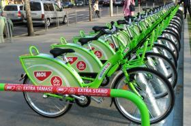

Bubi Radar
==========

Try it out at [bubiradar.net](http://bubiradar.net)

[Bubi](http://molbubi.bkk.hu/) is Budapest's public bike sharing service. It is run by Budapest's public transportation company, [BKK](http://www.bkk.hu/).

Bubi Radar was made as a personal project and uses publically available data about the location of and number of bikes at each station. Bubi Radar is not an official app; as far as I know Bubi or BKK know nothing about it.

Credits
=======
Created by [Laszlo Pandy](https://github.com/laszlopandy).

Images:
 * [refresh.svg](http://thenounproject.com/term/refresh/24732/): Designed by [Alexey Sohrin](http://www.thenounproject.com/asdesign.com.ua) from the [Noun Project](http://www.thenounproject.com)
 * [bike.svg](http://thenounproject.com/term/bicycle/536/): Public domain from the [Noun Project](http://www.thenounproject.com)
 * [back-arrow.svg](http://thenounproject.com/term/arrow/30535/): Designed by [Huu Nguyen](http://www.thenounproject.com/huu) from the [Noun Project](http://www.thenounproject.com)

 FAQ
 ===
 ## Why doesn't Bubi Radar show show the number of free bike docks at each station?
 
In some bike shaing systems such as Velib in Paris, bikes must be returned into a bike dock. If there are no free docks, you must take the bike to another station. However Bubi bikes have an electronic lock attached to them. If all the docks are full, this lock can be used to attach the bike to the green bar next to the station. Bikes can even be chained together, so you can always return a bike regardless of how many are there already.

